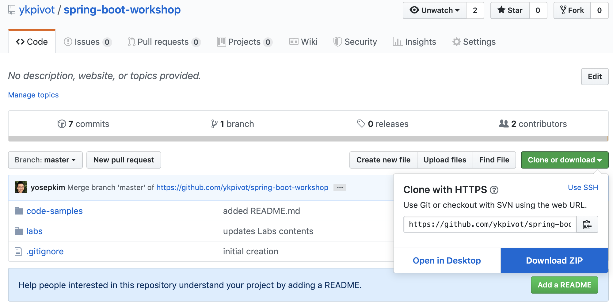

# Building a Spring Boot Application

In this lab we'll build and deploy a simple [Spring Boot](https://docs.spring.io/spring-boot/docs/current/reference/htmlsingle) application to Cloud Foundry whose sole purpose is to reply with
a standard greeting.

## Getting started

* Navigate to the folllowing git repo on *Github.com*.

```
https://github.com/ykpivot/spring-boot-workshop.git
```

* Download the repo as a ZIP file by clicking on **Clone or download** then **Download ZIP**.



* Unzip it into `c:\Users\{your-username}\Downloads\spring\projects\spring-boot-workshop`. Make sure the contents of the git repo is directly placed in the *spring-boot-workshop* folder.

* Open a Terminal (e.g., *cmd* or *powershell*). First, type in `c:` to first go to the `C` drive, then navigate to the **spring-boot-workshop** folder.

```bash
c:
cd c:\Users\{your-username}\Downloads\spring\projects\spring-boot-workshop
```

## Bootstrap your application using Spring Initializr

Now, visit `https://start.spring.io` to create a new Spring Boot project with the following values:

```
Project: Maven
Language: Java
Spring Boot: 2.1.6
Group: io.pivotal
Artifact: sample
Dependencies: Spring Web Starter 
```

When you click on the *Generate the project ...* button on the bottom, it will create and download a zip file named *sample.zip*. Unzip the file and extract the contents into a folder named `sample` inside the `c:\Users\{your-username}\Downloads\spring\projects\spring-boot-workshop` folder.

Return to the Terminal session you opened previously and change the working directory to be `c:\Users\{your-username}\Downloads\spring\projects\spring-boot-workshop`.

```bash
cd spring-boot-workshop
```

You should see the **sample** folder, when you run one of the following commands `ls` or `dir`.


Open this project in your editor/IDE of choice.

***Eclipse Import with Maven Help***

* Select *File > Import*

* In the subsequent dialog choose
*Maven > Existing Maven Project* then click the *Next* button.

* In the *Import Maven Project* dialog browse to the
*sample* directory (e.g.
`c:\Users\{your-username}\workspace\spring-boot-workshop\sample`) then click the *Open* button, then click the *Finish* button.

## Add an Endpoint
Within your editor/IDE complete the following steps:

* Create a new
package `io.pivotal.sample.controller` underneath **src/main/java**.
* Create
a new class named `GreetingController` in the aforementioned package.
* Add an `@RestController` annotation to the class
`io.pivotal.sample.controller.GreetingController` (i.e.,
**sample/src/main/java/io/pivotal/sample/controller/GreetingController.java**).

```java
package io.pivotal.sample.controller;

import org.springframework.web.bind.annotation.RestController;

@RestController
public class GreetingController {

}
```

Add the following request handler to the class
`io.pivotal.sample.controller.GreetingController` (i.e.,
**sample/src/main/java/io/pivotal/sample/controller/GreetingController.java**).

```java
@GetMapping("/hello")
public String hello() {
  return "Hello World!";
}
```
Completed:

```java
package io.pivotal.sample.controller;

import org.springframework.web.bind.annotation.RestController;
import org.springframework.web.bind.annotation.GetMapping;

@RestController
public class GreetingController {
  @GetMapping("/hello")
  public String hello() {
    return "Hello World!";
  }
}
```

## Build the _sample_ application

Return to the Terminal session and make sure your working directory is
set to be **spring-boot-workshop/sample**

First
we'll run tests

```bash
mvn test
```

Next we'll package the application as an executable jar

```bash
mvn package
```

## Run the _sample_ application

Now we're ready to run the application . Run the application
with:

```bash
java -jar target/sample-0.0.1-SNAPSHOT.jar
```

or we can run it using maven.


```bash
mvn spring-boot:run
```

You should see the application start up an
embedded Apache Tomcat server on port 8080 (review terminal output):

```bash
2019-07-22 17:40:18.193 INFO 92704 --- \[ main\] o.s.b.w.embedded.tomcat.TomcatWebServer : Tomcat started on port(s): 8080 (http) with context path '' 
2019-07-22 17:40:18.199 INFO 92704 --- \[ main\] i.p.s.SampleApplication : Started SampleApplication in 7.014 seconds (JVM running for 7.814)
```
Browse to http://localhost:8080/hello

Stop the _sample_
application. In the terminal window type **Ctrl + C**

## Deploy _sample_ to Pivotal Cloud Foundry

We've built and run the
application locally. Now we'll deploy it to Cloud Foundry.

Create an application manifest named `manifest.yml` in the root folder of your applcation using your IDE with the following content.

```yaml
---
applications:
- name: sample-{your-initial}
  instances: 1
  path: .\target\sample-0.0.1-SNAPSHOT.jar
```

Push application into Cloud Foundry

```bash
cf push
```

Find the URL created for your app in the
health status report or issue the following command to see your running apps.

```bash
cf apps
```

Browse to your app's **/hello** endpoint

Check the
log output:

```bash
cf logs sample-{your-initial} --recent
```
**Congratulations!**
You’ve just completed your first Spring Boot application.
