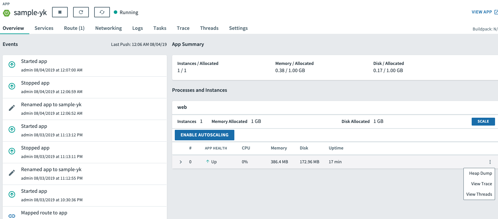
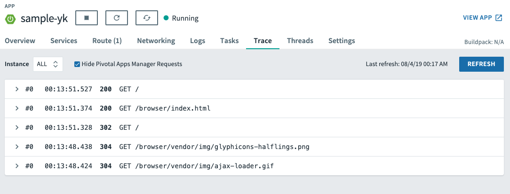
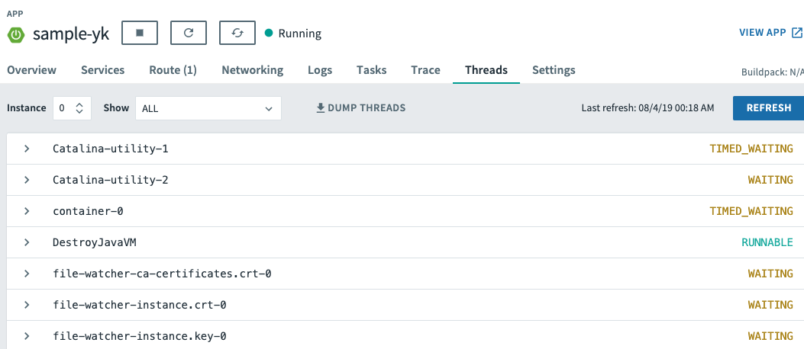
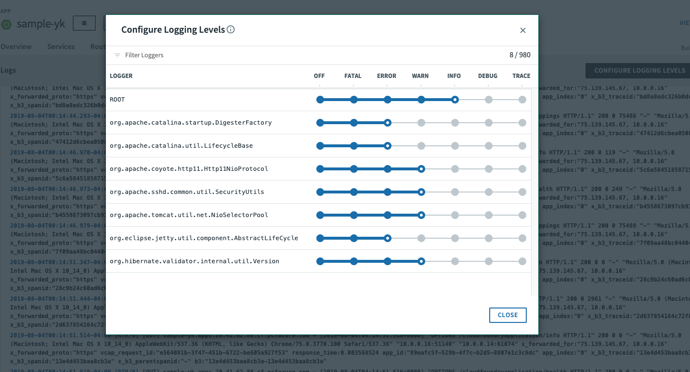

# Enhancing Boot Application with Metrics

## Set up the Actuator

Spring Boot includes a number of additional features to help you monitor and manage your application when it’s pushed to production. These features are added by adding **spring-boot-starter-actuator** to the classpath.  Our initial project setup already included it as a dependency.

* Verify the Spring Boot Actuator dependency in the following file: **sample/pom.xml**. you will need to add this.

```xml
<dependency>
    <groupId>org.springframework.boot</groupId>
    <artifactId>spring-boot-starter-actuator</artifactId>
</dependency>
```
By default Spring Boot does not expose these management endpoints (which is a good thing!).  Though you wouldn't want to expose all of them in production, we'll do so in this sample app to make demonstration a bit easier and simpler.  

* Add the following properties to **sample/src/main/resources/application.properties**.

```
management.endpoints.web.exposure.include=*
```

* Run the updated application

```bash
mvn clean spring-boot:run
```

* Try out the following endpoints with your browser. The output is omitted here because it can be quite large:

`http://localhost:8080/actuator/health`

-> Displays Application and Datasource health information.  This can be customized based on application functionality, which we'll do later.

`http://localhost:8080/actuator/beans`

-> Dumps all of the auto-configuration performed as part of application bootstrapping.

`http://localhost:8080/actuator/configprops`

-> Displays a collated list of all `@ConfigurationProperties`.

`http://localhost:8080/actuator/env`

-> Dumps the application’s shell environment as well as all Java system properties.

`http://localhost:8080/actuator/mappings`

-> Dumps all URI request mappings and the controller methods to which they are mapped.

`http://localhost:8080/actuator/threaddump`

-> Performs a thread dump.

`http://localhost:8080/actuator/httptrace`

-> Displays trace information (by default the last few HTTP requests).

`http://localhost:8080/actuator/flyway`

-> Shows any Flyway database migrations that have been applied.

* Stop the `sample` application with **CTRL-c**


## Include Build Info

* Add the following properties to **sample/src/main/resources/application.properties**.

```
info.build.artifact=@project.artifactId@
info.build.name=@project.name@
info.build.description=@project.description@
info.build.version=@project.version@
```
Note we're defining token delimited value-placeholders for each property.

* Again we'll use the web browser to verify that the Build information is now included.

```bash
http://localhost:8080/actuator/info
```

```json
{
  "build": {
    "artifact": "sample",
    "name": "sample",
    "description": "Demo project for Spring Boot",
    "version": "0.0.1-SNAPSHOT"
  }
}
```

* Stop the cloud-native-spring application.

*What Just Happened?*

We have mapped build properties into the /actuator/info endpoint.

Read more about exposing data in the /actuator/info endpoint [here](https://docs.spring.io/spring-boot/docs/current/reference/htmlsingle/#production-ready)

## Health Indicators

Spring Boot provides an endpoint `http://localhost:8080/actuator/health` that exposes various health indicators that describe the health of the given application.

Normally, the /actuator/health endpoint will only expose an UP or DOWN value.

```json
{
  "status": "UP"
}
```
We want to expose more detail about the health and well-being of the application, so we're going to need a bit more configuration to **sample/src/main/resources/application.properties**, add

```
management.endpoint.health.show-details=always
```
* Run the cloud-native-spring application:

```bash
mvn spring-boot:run
```

* Use httpie to verify the output of the health endpoint

```bash
http :8080/actuator/health
```

Out of the box is a _DiskSpaceHealthIndicator_ that monitors health in terms of available disk space. Would your Ops team like to know if the app is close to running out of disk space? DiskSpaceHealthIndicator can be customized via _DiskSpaceHealthIndicatorProperties_. For instance, setting a different threshold for when to report the status as DOWN.

```json
{
    "status": "UP",
    "details": {
        "diskSpace": {
            "status": "UP",
            "details": {
                "total": 499963170816,
                "free": 375287070720,
                "threshold": 10485760
            }
        },
        "db": {
            "status": "UP",
            "details": {
                "database": "H2",
                "hello": 1
            }
        }
    }
}
```

* Stop the *sample* application.

* Create the class _io.pivotal.sample.FlappingHealthIndicator_ (**sample/src/main/java/io/pivotal/FlappingHealthIndicator.java**) and into it paste the following code:

```java
package io.pivotal.sample;

import java.util.Random;

import org.springframework.boot.actuate.health.Health;
import org.springframework.boot.actuate.health.HealthIndicator;
import org.springframework.stereotype.Component;

@Component
public class FlappingHealthIndicator implements HealthIndicator {

    private Random random = new Random(System.currentTimeMillis());

    @Override
    public Health health() {
        int result = random.nextInt(100);
        if (result < 50) {
            return Health.down().withDetail("flapper", "failure").withDetail("random", result).build();
        } else {
            return Health.up().withDetail("flapper", "ok").withDetail("random", result).build();
        }
    }
}
```
This demo health indicator will randomize the health check.

* Build and run the _sample_ application:

```bash
$ mvn clean spring-boot:run
```

* Browse to `http://localhost:8080/actuator/health` and verify that the output is similar to the following (and changes randomly!).

```json
{
  "status": "DOWN",
  "details": {
    "flapping": {
      "status": "DOWN",
      "details": {
        "flapper": "failure",
        "random": 28
      }
    },
    "db": {
      "status": "UP",
      "details": {
        "database": "H2",
        "hello": 1
      }
    },
    "diskSpace": {
      "status": "UP",
      "details": {
        "total": 499266875392,
        "free": 242203193344,
        "threshold": 10485760
      }
    }
  }
}
```

## Metrics

Spring Boot provides an endpoint http://localhost:8080/actuator/metrics that exposes several automatically collected metrics for your application. It also allows for the creation of custom metrics.

* Browse to `http://localhost:8080/actuator/metrics`. Review the metrics exposed.

```json
{
  "names": [
    "jvm.threads.states",
    "jdbc.connections.active",
    "jvm.memory.used",
    "jvm.gc.memory.promoted",
    "http.server.requests",
    "jvm.memory.max",
    "jvm.gc.max.data.size",
    "jdbc.connections.max",
    "jdbc.connections.min",
    "jvm.memory.committed",
    "system.cpu.count",
    "logback.events",
    "tomcat.global.sent",
    "jvm.gc.pause",
    "jvm.buffer.memory.used",
    "tomcat.sessions.created",
    "jvm.threads.daemon",
    "system.cpu.usage",
    "jvm.gc.memory.allocated",
    "tomcat.global.request.max",
    "hikaricp.connections.idle",
    "hikaricp.connections.pending",
    "tomcat.global.request",
    "tomcat.sessions.expired",
    "hikaricp.connections",
    "jvm.threads.live",
    "jvm.threads.peak",
    "tomcat.global.received",
    "hikaricp.connections.active",
    "hikaricp.connections.creation",
    "process.uptime",
    "tomcat.sessions.rejected",
    "process.cpu.usage",
    "tomcat.threads.config.max",
    "jvm.classes.loaded",
    "hikaricp.connections.max",
    "hikaricp.connections.min",
    "jvm.classes.unloaded",
    "tomcat.global.error",
    "tomcat.sessions.active.current",
    "tomcat.sessions.alive.max",
    "jvm.gc.live.data.size",
    "hikaricp.connections.usage",
    "tomcat.threads.current",
    "hikaricp.connections.timeout",
    "jvm.buffer.count",
    "jvm.buffer.total.capacity",
    "tomcat.sessions.active.max",
    "hikaricp.connections.acquire",
    "tomcat.threads.busy",
    "process.start.time"
  ]
}
```

* Stop the *sample* application.

## Deploy *sample* to Pivotal Cloud Foundry

* When running a Spring Boot application on Pivotal Cloud Foundry with the actuator endpoints enabled, you can visualize actuator management information on the Applications Manager app dashboard.  To enable this there are a few properties we need to add.  Add the following to **sample/resources/application.properties**:

```
management.cloudfoundry.enabled=true
management.cloudfoundry.skip-ssl-validation=true
```

* Push application into Cloud Foundry

```bash
  mvn package
  cf push
```

* Browse to your app.  Also view your application details in the Apps Manager UI:



* You can also view request traces



* and information on threads.




* From this UI you can dynamically change logging levels:



**Congratulations!** You’ve just learned how to add health and metrics to any Spring Boot application.
